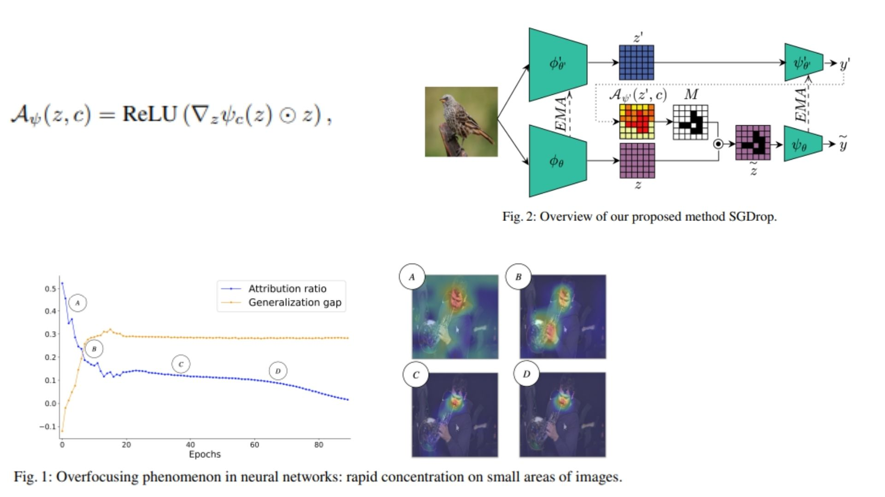

# 🔬 OverfocusCNN-Replication PyTorch Implementation

This repository contains a replication of **Convolutional Neural Networks with Saliency-Guided Dropout (SGDrop)** using PyTorch. The goal is to build a **CNN backbone** that prevents overfocusing on highly salient regions and encourages the network to attend to diverse features.

- Implemented **CNN** with **SGDrop** for saliency-guided regularization.  
- Architecture:  
**Conv1 → ResidualBlock1 → ResidualBlock2 → ResidualBlock3 → BN → ReLU → AvgPool → Flatten → FC**  
**Paper**: [The Overfocusing Bias of CNNs: A Saliency-Guided Regularization Approach](https://arxiv.org/abs/2409.17370)

---

## 🖼 Overview – OverfocusCNN with SGDrop

  

- **Figure 1:** Standard CNN residual connections with SGDrop. Each residual block adds its input to the output via identity or projection shortcuts. SGDrop is applied to the most salient features during training to redistribute attention.  

- **Figure 2:** Conceptual illustration of SGDrop:  
  - Attribution maps identify highly salient features.  
  - Top ρ-quantile features are masked (dropped) to prevent overfocusing.  
  - This encourages the network to learn from less dominant features, improving generalization.

### 🔢 Mathematical Formulation

The saliency map and dropout are computed as:

```math
\mathcal{A}_\psi (z,c) = \text{ReLU}\left( \nabla_z \psi_c(z) \odot z \right)
```
- `z` = latent feature map extracted by the encoder ϕ  
- `ψ_c(z)` = class score for class `c` from the classifier ψ  
- `∇_z ψ_c(z)` = gradient of class score w.r.t. latent features  
- `⊙` = element-wise multiplication (Hadamard product)  
- `ReLU` ensures only positive gradients are considered, similar to Grad-CAM  

The SGDrop mask is computed by:

```math
M_f(x,c,ρ) = I[\mathcal{A}_\psi(z,c) ≤ q_ρ]
```
Where:  
- `q_ρ` = upper ρ-quantile of attribution values in `A_ψ(z,c)`  
  - This means the threshold above which the top ρ% most salient features lie.  
- `I[·]` = indicator function returning 1 if condition is True, 0 otherwise  
  - Used to create a binary mask that keeps less salient features (1) and drops the most salient ones (0).  
- `x̃ = x ⊙ M_f(x,c,ρ)` gives the saliency-regularized features  
  - The original features `x` are element-wise multiplied by the mask to drop the highly salient ones.

> In short: SGDrop **selectively drops the top ρ% most salient features** during training. This forces the network to diversify its attention and not rely solely on narrow, high-importance regions, improving generalization.

---
## 🏗 Project Structure

```bash
OverfocusCNN-Replication/
│
├── src/
│   ├── layers/
│   │   ├── conv_layer.py
│   │   ├── residual_block.py
│   │   ├── shortcut_layer.py
│   │   ├── saliency_regularization.py
│   │   ├── pool_layers/
│   │   │   ├── maxpool_layer.py
│   │   │   └── avgpool_layer.py
│   │   ├── flatten_layer.py
│   │   └── fc_layer.py
│   │
│   ├── model/
│   │   └── overfocus_cnn.py
│   │
│   └── config.py
│
├── requirements.txt
└── README.md
```
---

## 🔗 Feedback

For questions or feedback, contact: [barkin.adiguzel@gmail.com](mailto:barkin.adiguzel@gmail.com)
